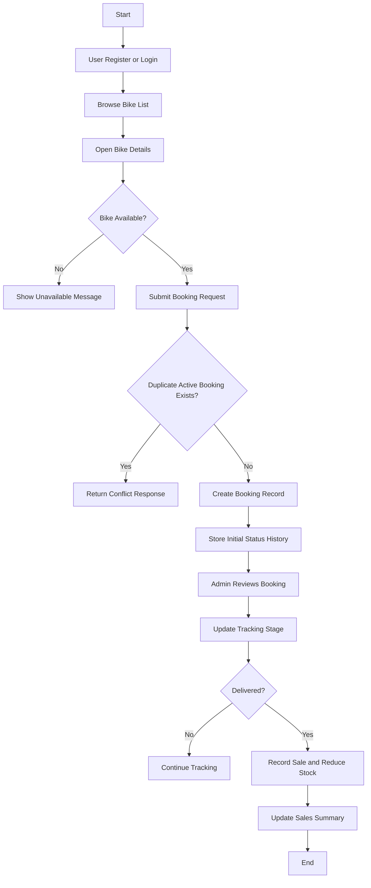
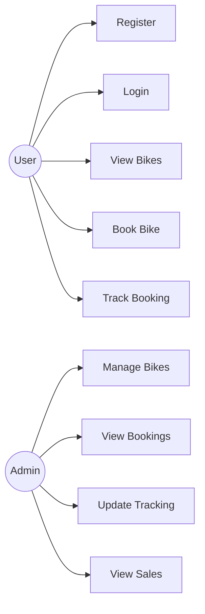
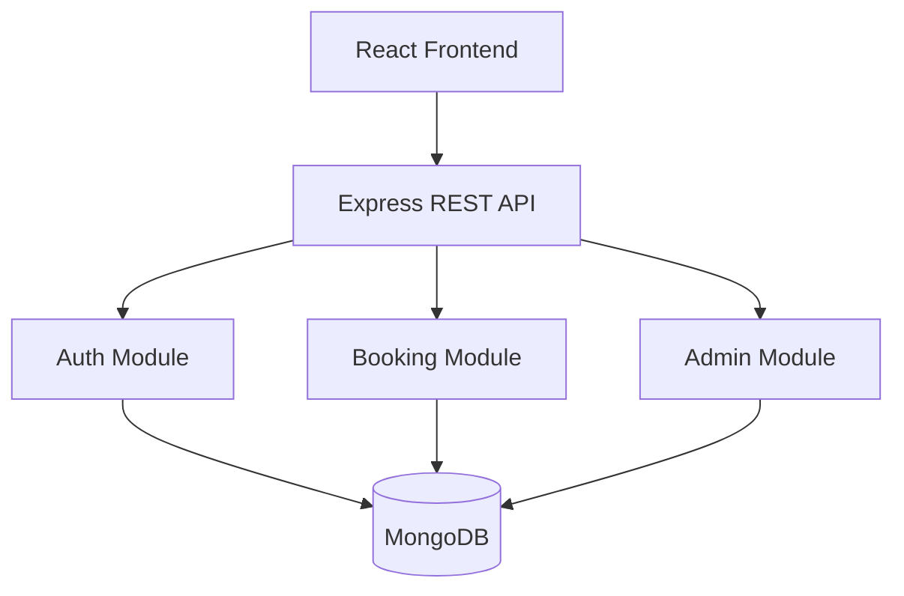

# Showroom Management System

This project is a bike showroom management system built with React on the frontend and Node.js, Express, and MongoDB on the backend. It supports user registration, login, bike browsing, bike booking, booking tracking, admin bike management, and sales tracking.

## End-to-End Flow

1. A user registers or logs in through the authentication module.
2. The user browses the bike inventory and opens a bike detail page.
3. When the user books a bike, the backend checks for an existing active booking for the same bike and same user identity.
4. If no duplicate booking exists, a new booking is created with a unique booking ID and initial status history.
5. The admin can view all bookings, update booking tracking stages, and manage the bike inventory.
6. When a booking reaches delivered status, the backend updates the related bike stock, total sales, yearly sales, and delivery timestamp.
7. Sales summary and yearly sales reports are then available through the admin API.

## UML Design

### 1. Flowchart

### 2. Use Case View

### 3. System Component View

## Data Model

The backend uses MongoDB collections that behave like tables in a relational system. The main collections are users, bikes, and bookings.

### User Collection

| Attribute | Type | Description |
| --- | --- | --- |
| username | String | Unique username for login and display |
| email | String | Unique email address, stored in lowercase |
| password | String | Hashed password |
| phone | String | User phone number |
| refreshToken | String | Refresh token for session renewal |
| forgotPasswordExpire | Date | Expiry time for password reset flow |
| emailVarificationToken | String | Hashed email verification token |
| emailVarificationExpiry | Date | Expiry time for email verification token |
| isEmailVarified | Boolean | Email verification status |
| createdAt | Date | Automatically added timestamp |
| updatedAt | Date | Automatically added timestamp |

### Bike Collection

| Attribute | Type | Description |
| --- | --- | --- |
| id | Number | Unique bike identifier |
| name | String | Bike name |
| brand | String | Manufacturer name |
| price | Number | Bike price |
| engine_cc | Number | Engine capacity |
| mileage | String | Mileage value |
| fuel_type | String | Fuel type |
| transmission | String | Transmission type |
| color_options | String[] | Available color options |
| stock | Number | Available units in inventory |
| image | String | Image URL |
| description | String | Detailed bike description |
| bookingStatus | String | Current booking state: pending, confirmed, in-transit, delivered, cancelled |
| totalSoldUnits | Number | Total units sold |
| totalSalesAmount | Number | Total sales amount |
| yearlySales | Object[] | Year-wise sales summary |
| createdAt | Date | Automatically added timestamp |
| updatedAt | Date | Automatically added timestamp |

### YearlySales Embedded Object

| Attribute | Type | Description |
| --- | --- | --- |
| year | Number | Sales year |
| units | Number | Units sold in that year |
| amount | Number | Sales amount for that year |

### Booking Collection

| Attribute | Type | Description |
| --- | --- | --- |
| bookingId | String | Unique booking reference ID |
| user | Object | Embedded user snapshot |
| bike | Object | Embedded bike snapshot |
| bookingStatus | String | Booking status: confirmed, processing, in-transit, reaching-showroom, delivered, cancelled |
| isSaleRecorded | Boolean | Indicates whether sale has been recorded |
| deliveredAt | Date | Delivery completion time |
| statusHistory | Object[] | Booking status history timeline |
| createdAt | Date | Automatically added timestamp |
| updatedAt | Date | Automatically added timestamp |

### Booking User Snapshot

| Attribute | Type | Description |
| --- | --- | --- |
| userId | String | Optional reference to the user account |
| username | String | Username at booking time |
| email | String | Email at booking time |
| phone | String | Phone number at booking time |

### Booking Bike Snapshot

| Attribute | Type | Description |
| --- | --- | --- |
| bikeId | Number | Bike identifier |
| name | String | Bike name |
| brand | String | Bike brand |
| price | Number | Bike price at booking time |
| image | String | Bike image URL |
| engine_cc | Number | Engine capacity |
| mileage | String | Mileage at booking time |
| fuel_type | String | Fuel type |
| transmission | String | Transmission type |

### Booking Status History Object

| Attribute | Type | Description |
| --- | --- | --- |
| status | String | Status entry for the booking timeline |
| note | String | Optional message for the update |
| updatedAt | Date | Time when the status was added |

## Key Process Summary

| Step | System Action |
| --- | --- |
| Authentication | Register and login users, then issue access and refresh tokens |
| Booking | Validate user and bike data, prevent duplicate active bookings, create a booking |
| Tracking | Admin moves booking forward through confirmed, reaching-showroom, and delivered stages |
| Delivery | On delivered, update bike stock, sales totals, and yearly sales records |
| Reporting | Admin views all bookings and sales summaries |

## Main API Routes

| Module | Route | Purpose |
| --- | --- | --- |
| Auth | /api/v1/auth/register | Register a new user |
| Auth | /api/v1/auth/login | Log in an existing user |
| Booking | /api/v1/bookings | Create a booking |
| Booking | /api/v1/bookings/user-bike | Get a user bike booking |
| Booking | /api/v1/bookings/:bookingId | Get booking by booking ID |
| Admin | /api/v1/admin/bikes | Manage bike inventory |
| Admin | /api/v1/admin/bookings | View all bookings |
| Admin | /api/v1/admin/bookings/:bookingId/tracking | Update booking tracking status |
| Admin | /api/v1/admin/sales/summary | View sales summary |
| Admin | /api/v1/admin/sales/yearly | View yearly sales details |

## Notes

- MongoDB collections are modeled like database tables, but the implementation uses Mongoose schemas.
- Booking records store a snapshot of user and bike data so historical booking details remain stable even if the main records change later.
- When a booking is marked delivered, the backend automatically updates inventory and sales reporting data.
